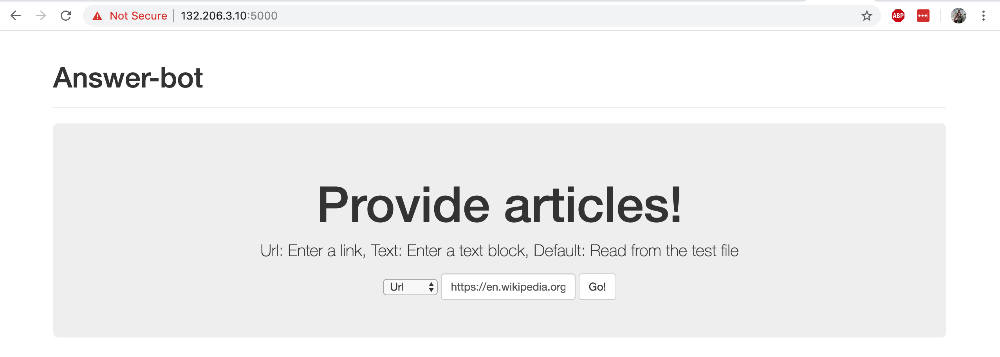
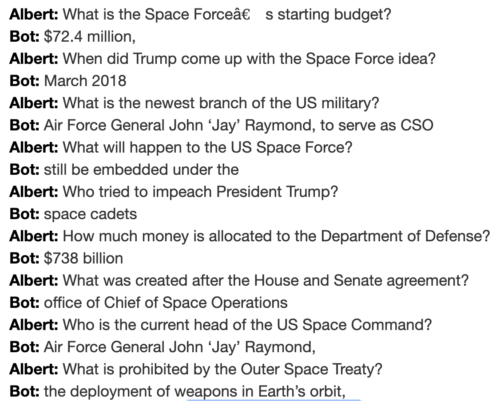
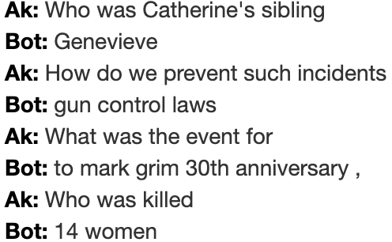
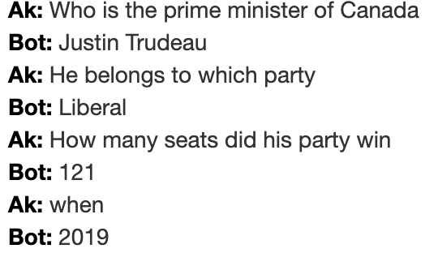
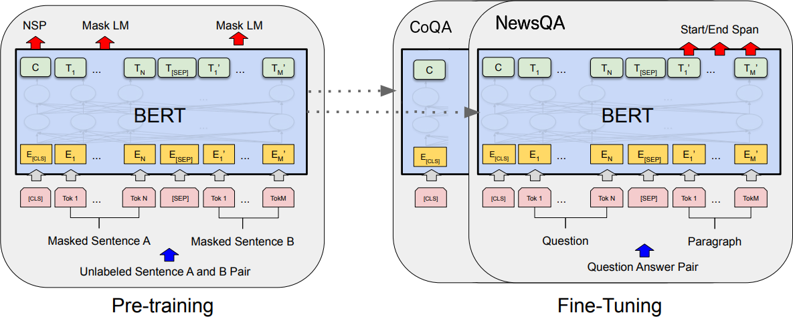

# Question Answering through Multi-Stage Transfer Learning

The project was completed with A.Arodi and AMO. Camacho as course final project of [COMP 550](https://www.mcgill.ca/study/2017-2018/courses/comp-550) Fall 2019 at McGill university. A competitive language model was achieved by applying transfer learning on two distinct datasets, [NewsQA](https://www.microsoft.com/en-us/research/project/newsqa-dataset/) and [CoQA](https://stanfordnlp.github.io/coqa/). The model is deployed on a web-server to validate the linguistic and conversational properties through empirical experiments. The fine-tuned model exhibits the favourable properties of both the datasets. It achieves evaluation scores within the state-of-the-art range.\
To Launch the training and evaluation, use the following command:

```
python run_newsqa.py \
       --model_type bert \
       --model_name_or_path bert-base-cased \
       --do_train \
       --do_eval \
       --do_lower_case \
       --train_file NEWSQA/combined-newsqa-data-v1.json \
       --predict_file NEWSQA/combined-newsqa-data-v1.json \
       --per_gpu_train_batch_size 16 \
       --learning_rate 3e-5 \
       --num_train_epochs 2.0 \
       --max_seq_length 320 \
       --doc_stride 128 \
       --save_steps 10000 \
       --output_dir tmp_test_news_bert/
```

Dependencies:

```
pytorch
huggingface
Flask
```
## Web application
The web application can be launched with `flask run` in `Answer-Bot` folder. The final trained model is loaded to serve as an AI chat bot which understand user-defined text content and perform real-time conversational dialogue. The application is developed with a user interface where users can provide the source of knowledge by
- providing a link to any article;
- providing a block of text in local file;
- typing raw text.



### Keyword matching


### Paraphrasing


### Co-reference


## Datasets
The NewsQA dataset incorporates over 100,000 human-generated question-answer pairs, based on a set of over 12,744 news articles from CNN. The articles are partitioned at random into training, development, and test sets. The QA pairs cover a wide range of topics, due to which it is difficult to train and there is a large gap of performance between humans and machines.

CoQA is a QA dataset containing over 127,000 question-answer pairs collected from over 8000 conversations. Similar to the NewsQA dataset, CoQA has diverse domains, while it presents two unique features. First, the questions are conversational. Second, the answers can be free-form text, but each answer also comes with an evidence subsequence highlighted in the passage.

## Models
Model architectures based on *transformer* neural networks are investigated, including
- BERT (Bidirectional Encoder Representations from Transformers) model
- XLNET model
- XLM model
In particular [HuggingFace's Transformer library](https://github.com/huggingface/transformers) was used to perform the experiments.

### Transfer learning
An immediate impact of the introduction of BERT comes with the popularization of **transfer learning** for particular tasks. Given a model trained on *source* task A with, by retraining it on *target* task B, such model transfers its previous knowledge to achieve a better performance on task B.



## Validation
The metrics used for validation include exact output score and f1 score on the NewsQA development dataset.
- **Exact match** measures the percentage of predictions that match the consensus answer exactly.
- **f1 score** measures the harmonic mean of precision and recall, where precision and recall are calculated from the predicted and goal tokens.

Model | Exact match score | f1 score | Time
---|---|---|---
**BERT** | **47.5%** | **61.28%** | **9h7m**
XLNET | 41.14% | 54.57% | 13h2m
XLM | 32.11% | 45.77% | 9h9m

### Two stage fine-tuning
The final model is based on a two stage fine-tuning of the BERT model:
- **First stage** on CoQA dataset
- **Second stage** on NewsQA dataset

Model | Stage1 Exact | Stage1 f1 | Stage2 Exact | Stage2 f1
---|---|---|---|---
BERT-CoQA-NewsQA | 23.69% | 52.56% | **50.06%** | **65.30%**